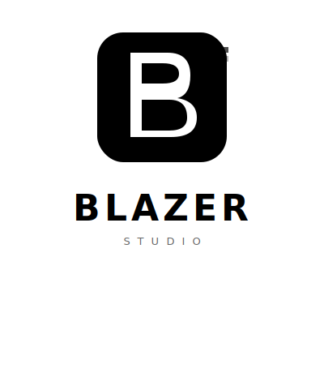

<div align="center">



# Blazer Studio

**AI-powered local data studio for macOS, Windows, and Linux**

Chat with your data · Run DuckDB SQL · Build agentic analysis pipelines

[](LICENSE)
[](https://github.com/gaurangAkulkarni/blazer/releases)
[](https://tauri.app)
[](https://duckdb.org)

[Website](https://gaurangAkulkarni.github.io/blazer) · [Download](https://github.com/gaurangAkulkarni/blazer/releases) · [Report an issue](https://github.com/gaurangAkulkarni/blazer/issues)

</div>

---

## What is Blazer Studio?

Blazer Studio is a free, open-source desktop app that lets you explore and analyse data files using natural language and SQL — entirely on your machine. No cloud, no accounts, no telemetry.

Load a Parquet, CSV, or Excel file and ask questions in plain English. The AI writes the SQL, runs it, reads the actual results, and gives you a grounded answer. Or switch to the SQL console and write queries directly.

---

## Features

- **AI Chat** — Ask questions in plain English. Supports Anthropic Claude, OpenAI, and local Ollama models. Streams responses with live query execution.
- **DuckDB Console** — Full SQL editor with syntax highlighting, query history, snippet library, and schema explorer.
- **Agentic Mode** — Describe a goal. The agent plans steps, runs queries, reads the data, adapts to findings, and delivers a full written assessment.
- **Result Pane** — Every query result opens in a dedicated pane with table view, charts, column stats, and CSV export.
- **Schema Explorer** — Auto-detects columns, types, and cardinality from loaded files. Column-level profiling built in.
- **Multi-provider LLM** — Anthropic, OpenAI, Ollama, or any OpenAI-compatible endpoint via custom base URL.
- **Privacy first** — All data and queries stay local. Your files never leave your machine.

---

## Query Engines

Blazer Studio uses two query engines — one stable and in active focus, one a long-term research effort.

### DuckDB ✅ Stable — primary focus

Blazer Studio embeds [DuckDB](https://duckdb.org) as its SQL analytics engine. DuckDB is an open-source, in-process analytical database developed by [Stichting DuckDB Foundation](https://duckdb.org/foundation) and licensed under the [MIT License](https://github.com/duckdb/duckdb/blob/main/LICENSE).

Blazer Studio uses DuckDB as a library dependency via the [`duckdb` Rust crate](https://crates.io/crates/duckdb). It is not a fork, modification, or redistribution of DuckDB, and this project is not affiliated with or endorsed by the DuckDB Foundation or DuckDB Labs.

Supported file formats via DuckDB: **Parquet, CSV/TSV, Excel (XLSX), JSON, and directories of any of the above.**

### Blazer Engine 🚧 Work in progress

The Blazer engine is a ground-up columnar compute engine built on [Apple MLX](https://github.com/ml-explore/mlx), targeting GPU-accelerated data operations on Apple Silicon (M1/M2/M3/M4). Core operators are scaffolded. Python and Node.js bindings are available for early experimentation.

> **This engine is not yet production-ready.** All active development is focused on the DuckDB integration for now. The Blazer engine will become the primary engine in a future release, exclusively for Apple Silicon Macs.

| Engine | Status | Requires |
|---|---|---|
| **DuckDB** | ✅ Stable — primary focus | macOS, Linux, Windows |
| **Blazer** | 🚧 Work in progress | Apple Silicon (M-series) only |

---

## Getting Started

### Prerequisites

- macOS 12+, Windows 10+, or Linux (x64 / ARM64)
- [Rust](https://rustup.rs) toolchain
- [Node.js](https://nodejs.org) 18+
- [Tauri CLI](https://tauri.app/start/prerequisites/) v2

> **Note:** The Blazer engine (MLX-based) is Apple Silicon only. The DuckDB engine — which powers all current SQL features — runs on all three platforms.

### Run in development

```bash
git clone https://github.com/gaurangAkulkarni/blazer.git
cd blazer/playground
npm install --prefix ui
cargo tauri dev
```

### Build for release

```bash
cd blazer/playground
cargo tauri build
```

The `.dmg` / `.app` will be in `playground/target/release/bundle/`.

---

## Using the App

1. **Load a file** — Click the paperclip icon or drag a `.parquet`, `.csv`, or `.xlsx` file into the chat.
2. **Ask a question** — Type in the chat input. The AI will generate SQL, run it, and answer using the actual data.
3. **Run SQL directly** — Switch to the Console tab and write DuckDB SQL against your files.
4. **Agentic analysis** — Toggle the robot icon in the toolbar. Describe your analytical goal and the agent will plan and execute a full multi-step analysis.
5. **Configure LLM** — Open Settings (⌘,) to enter your API key and choose a provider/model.

---

## Tech Stack

| Layer | Technology |
|---|---|
| Desktop framework | [Tauri 2](https://tauri.app) (Rust) |
| SQL analytics | [DuckDB](https://duckdb.org) (embedded via `duckdb` crate, MIT License, © Stichting DuckDB Foundation) |
| Blazer engine | [Apple MLX](https://github.com/ml-explore/mlx) (WIP) |
| Frontend | React + TypeScript + Tailwind CSS |
| LLM providers | Anthropic, OpenAI, Ollama |
| Node.js bindings | [napi-rs](https://napi.rs) |
| Python bindings | [PyO3](https://pyo3.rs) |

---

## Project Structure

```
blazer/
├── crates/
│   ├── engine/          # Blazer columnar engine (WIP, MLX-based)
│   ├── mlx-sys/         # Rust bindings to Apple MLX
│   ├── node-bindings/   # Node.js (napi-rs) bindings
│   └── py-bindings/     # Python (PyO3) bindings
├── playground/          # Tauri desktop app
│   ├── src/             # Rust backend (Tauri commands)
│   └── ui/              # React/TypeScript frontend
└── docs/                # GitHub Pages website
```

---

## Roadmap

- [ ] Blazer engine: complete core SQL operators on MLX
- [ ] Blazer engine: streaming execution for large datasets
- [ ] Windows / Linux support (DuckDB engine)
- [ ] Plugin/skill system for custom LLM prompts
- [ ] GitHub Releases with pre-built `.dmg`

---

## Contributing

Issues and PRs are welcome. This is an independent personal open-source project — if you find it useful, a ⭐ goes a long way.

---

## License

[MIT](LICENSE) © 2025 [Gaurang Kulkarni](https://github.com/gaurangAkulkarni)

### Third-party notices

This project uses the following open-source dependencies. Their licenses are independent of this project's MIT license.

| Dependency | License | Copyright |
|---|---|---|
| [DuckDB](https://duckdb.org) | MIT | © Stichting DuckDB Foundation |
| [Tauri](https://tauri.app) | MIT / Apache 2.0 | © Tauri Programme within the Commons Conservancy |
| [Apple MLX](https://github.com/ml-explore/mlx) | MIT | © Apple Inc. |
| [React](https://react.dev) | MIT | © Meta Platforms, Inc. |

> Blazer Studio is an independent personal open-source project. It is not affiliated with, endorsed by, or sponsored by Kvell, DuckDB Foundation, DuckDB Labs, Apple Inc., or any other organisation.
